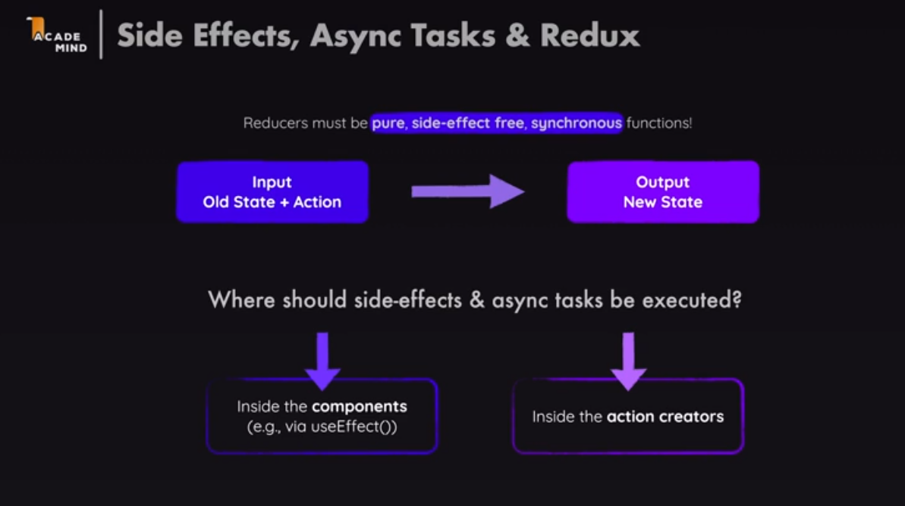
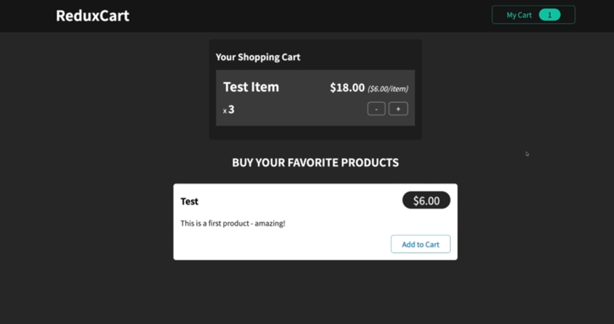
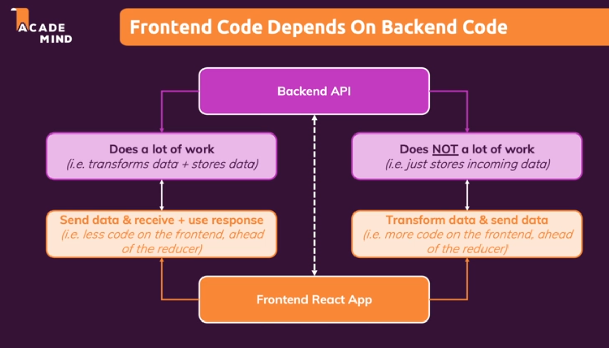
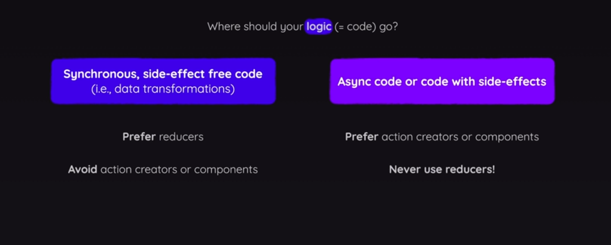

### C:\Users\Admin\OneDrive\Desktop\react_all\Section21-AdvancesRedux\01-starting-project> 

# 328 Reduc & Side effects (and async code)



# 329 Refresher/ practice: Part 1/2

### We need to add redux to the current project to work on it. 



### We will make this ui work with redux

### Start by installing @reduxjs/toolkit

## Consider the git first commit for this changes reference. 

# 331 Using Firebase as a Backend
### Refer udemy attached text file 
### this has the instructions to create a databse in the Firebase. 

# 332 Redux & Async Code 
### Now, we have already repeated the core redux functionality by making the project work as intended. 

### Now we will see how we can connect redux with side effects and async code. 

### when ever we will handle events we want to send requests to backend to store data. 

### We should keep in mind that reducers must be side effect free and synchronous functions. 
### Never run any asyc code inside the reducers. 

## Where should the side-effects & async tasks be executed?
### We can do it - 
#### > Inside the components 
#### > Inside the action creators 

### We will see the both option in the following lectures.
### It is upto me which option to prefer. 

# 333 FrontEnd vs Backend Code

## For example: Lets assume we will work on the ProductItem component's addItemToCart function
## Here we are only sending the data of items to the reducer. 
### The reducer has all the logic to save data. as shown below in addItemToCart.
### if we send the requect to both firebase and reducer in handleAddToCart, reducer will manage the logic for saving. But the firebase is a dumb database to have these logic.
### However, we can add this logic to firebase but we are not goint to do this becasue we are learning front end. 

### Therefore it is important to recognize where we want to write the logic depends on the backend. 


### In the addItemToCart and Other redux functions in them we are not getting finished cart item which ia ready to be saved. But, instead we have logic in these function to save data properly. 

### Lets assume, we have a backend, and it take cares of all these logic. Then, we do not need to have these logic in the frontend. 

### This is not the case. We need to put logic in the frontend. At the same time send th data to the backend without doing the sending inside the reducer. 

### because we learnt that we are not allowed to send our request inside the reducer function. 

```jsx
  function handleAddToCart() {
    dispatch(
      cartActions.addItemToCart({
        id,
        title,
        price,
      }))
  }
```

```jsx
addItemToCart(state, action) {
            const newItem = action.payload;
            const existingItem = state.items.find(item => item.id === newItem.id);
            state.totalQuantity++;
            if (!existingItem) {
                state.items.push({
                    id: newItem.id,
                    price: newItem.price,
                    quantity: 1,
                    totalPrice: newItem.price,
                    name: newItem.title
                })
            } else {
                existingItem.quantity++;
                existingItem.totalPrice = existingItem.totalPrice + newItem.price;
            }
}
```

# 334 Where to put our logic?

### we can run it the component.
### We can run it inside the action creators. 

## How? We will see this working in the productitem comp. 




# 335 Using sideEffect with Redux

## Remember: The realtime data base from firebase will override the existing data everytime put request is made (PUT === replace)

### We will dispatch the actions from the components and let reducer do its job using logic as we did before. 

### But we will sync the data with the server.

#### We will let the front end do its job, let redux update the store and then in second step we will send request to server. We do not necessarly need to do it inside the reducer where we r not alloed to do it. 

### Instead, in the App.js file we will write this code. 

```jsx
import { useSelector } from 'react-redux';
import Cart from './components/Cart/Cart';
import Layout from './components/Layout/Layout';
import Products from './components/Shop/Products';
import { useEffect } from 'react';

let URL = 'https://first-project-33326-default-rtdb.firebaseio.com/';

function App() {
  const showCart = useSelector(state => state.ui.cartIsVisible);
  const cart = useSelector(state => state.cart);  // this sets up the subscription to the redux // new 

  useEffect(() => {  // new 
    fetch('https://first-project-33326-default-rtdb.firebaseio.com/cart.json', { // .json is firebase specific and cart will create a node in the DB
      method: 'PUT',                                                             // by sending the put request we will override the existing data 
       body: JSON.stringify(cart),
    }) 
  }, [cart])   // this effect will reexecute when ever our cart changes                   
  return (
    <Layout>
      {showCart && <Cart />}
      <Products />
    </Layout>
  );
}

export default App;

```

# 336 A Problem with useEffect() 

### add 2 items in the cart and then refrest the page. You will see that the cart is getting emptied. 

```text 
A Problem with useEffect()
We face one problem when using useEffect the way we currently do it: It will execute when our app starts.

Why is this an issue?

It's a problem because this will send the initial (i.e. empty) cart to our backend and overwrite any data stored there.

We'll fix this over the next lectures, I just wanted to point it out here!
```

# 337 Handling Http States & Feedback with redux

### At this point we are just sending http request and not doing anything with the response and errors. 
### To handle the response and errors, we will utilize a new component notification.js and module.cc attached to this lec. Add them inside the UI folder. It is just a bar at the top to display status. 

### To use it we will start making changes in the App.js

```jsx
const responseData = await response.json();
```

## Using Fragment from react can generate issuse upcomming

### this is all the changes done to the app.js
```jsx
import { useSelector, useDispatch } from 'react-redux';
import Cart from './components/Cart/Cart';
import Layout from './components/Layout/Layout';
import Products from './components/Shop/Products';
import { Fragement, useEffect } from 'react';
import { uiActions } from './store/ui-slice';
import Notification from './components/UI/Notification'; // new 

let isInitial = true;  // new // 

function App() {
  const dispatch = useDispatch();

  const showCart = useSelector(state => state.ui.cartIsVisible);
  const cart = useSelector(state => state.cart);

  const notification = useSelector(state => state.ui.notification)  // new 

  useEffect(() => {
    const sendCartData = async () => {
      dispatch(
        uiActions.showNotification({
          status: 'pending',
          title: 'Sending...',
          message: 'Sending cart data!'
        })
      );
      const response = await fetch('https://first-project-33326-default-rtdb.firebaseio.com/cart.json', {
        method: 'PUT',
        body: JSON.stringify(cart),
      });

      if (!response.ok) {
        throw new Error('Sending cart data failed.');
      }

      // const responseData = await response.json(); we are not intrested in this because we are not getting response from server.

      dispatch(
        uiActions.showNotification({
          status: 'success',
          title: 'success...',
          message: 'success in Sending cart data!'
        })
      );
    }

    if(isInitial){   // this will stop the below code to send teh request to server with intial empty cart. 
      isInitial = false;
      return;
    }

    sendCartData().catch(error => {  // the sendCartData sends a promise so we can catch it. 
      uiActions.showNotification({
        status: 'Failed',
        title: 'Failed',
        message: 'Failed in Sending cart data!'
      })
    })
  }, [cart, dispatch])  // dispatch is also a dependency now. // react will ensure the useeffect wont run because of dispatch.
  // It will ensure the effect to run only when the cart is changed. 
  return (
    <>
      {notification && 
      (<Notification
        status={notification.status}
        title={notification.title}
        message={notification.message} 
      />)}    {/* new */}
      <Layout>
        {showCart && <Cart />}
        <Products />
      </Layout>
    </>
  );
}

export default App;

```

# 338 Using an Action Creator Thunk (still need to get deeper understanding of thunks)
### Above we put our logic in the component. Now we will learn to put this logic inside the action creators. 


### we have already used action creators many time like -
#### Here showNotification is an action create like many we have worked with. 
#### these are automatically created actioncreators. 
```js
useEffect(() => {
    const sendCartData = async () => {
      dispatch(
        uiActions.showNotification({
          status: 'pending',
          title: 'Sending...',
          message: 'Sending cart data!'
        })
      );
      const response = await fetch('https://first-project-33326-default-rtdb.firebaseio.com/cart.json', {
        method: 'PUT',
        body: JSON.stringify(cart),
      });
```

### We can write our own action creators. 
### We can write them to create so called thunks. 

## What is a thunk?
### it is simple an function that delays an action until something else finished. 
#### An action creator function that does not return the action itself but instead another function which eventually returns the action.

### For this we will move the sendCartData out of the app component. 
### we will write the custom actionCreator  in the cart-slice.js file itself. this file is responsible for managing the cart. 

## Why we wanna use this pattern ? - Bcoz its simply an alternative to writing code in component. It also makes the component leaner.

##### App.js its code is moved to cart-slice.js
```jsx
import { useSelector, useDispatch } from 'react-redux';
import Cart from './components/Cart/Cart';
import Layout from './components/Layout/Layout';
import Products from './components/Shop/Products';
import Notification from './components/UI/Notification';
import {sendCartData} from './store/cart-slice'; // new 
import { useEffect } from 'react'; 

let isInitial = true;  
function App() {
  const dispatch = useDispatch();

  const showCart = useSelector(state => state.ui.cartIsVisible);
  const cart = useSelector(state => state.cart);

  const notification = useSelector(state => state.ui.notification)  

  useEffect(() => { // changes 

    if(isInitial){   
      isInitial = false;
      return;
    }

    dispatch(sendCartData(cart));

  }, [cart, dispatch])  
  return (
    <>
      {notification && 
      (<Notification
        status={notification.status}
        title={notification.title}
        message={notification.message} 
      />)}    {/* new */}
      <Layout>
        {showCart && <Cart />}
        <Products />
      </Layout>
    </>
  );
}

export default App;

```

```jsx
import { createSlice } from '@reduxjs/toolkit';
import { uiActions } from '../store/ui-slice';


const cartSlice = createSlice({
    name: 'cart',
    initialState: {
        items: [],
        totalQuantity: 0,
    },
    reducers: {
        addItemToCart(state, action) {
            const newItem = action.payload;
            const existingItem = state.items.find(item => item.id === newItem.id);
            state.totalQuantity++;
            if (!existingItem) {
                state.items.push({
                    id: newItem.id,
                    price: newItem.price,
                    quantity: 1,
                    totalPrice: newItem.price,
                    name: newItem.title
                })
            } else {
                existingItem.quantity++;
                existingItem.totalPrice = existingItem.totalPrice + newItem.price;
            }
        },
        removeItemFromCart(state, action) {
            const id = action.payload;
            const existingItem = state.items.find(item => item.id === id);
            state.totalQuantity--;
            if (existingItem.quantity === 1) {
                state.items = state.items.filter(item => item.id !== id);
            } else {
                existingItem.quantity--;
                existingItem.totalPrice = existingItem.totalPrice - existingItem.price;
            }
        }
    }
});


// unlike the typical actionCrators this dosent return actions but it returns a function 
export function sendCartData(cart) {
    return async (dispatch) => {
        dispatch(
            uiActions.showNotification({
                status: 'pending',
                title: 'Sending...',
                message: 'Sending cart data!'
            })
        );

        async function sendRequest() {
            const response = await fetch('https://first-project-33326-default-rtdb.firebaseio.com/cart.json', {
                method: 'PUT',
                body: JSON.stringify(cart),
            });

            if (!response.ok) {
                throw new Error('Sending cart data failed.');
            }
        }

        try {
            await sendRequest();
            dispatch(
                uiActions.showNotification({
                    status: 'success',
                    title: 'success...',
                    message: 'success in Sending cart data!'
                })
            );
        } catch (error) {

            sendCartData().catch(error => {  // the sendCartData sends a promise so we can catch it. 
                uiActions.showNotification({
                    status: 'Failed',
                    title: 'Failed',
                    message: 'Failed in Sending cart data!'
                })
            })
        }
    }
}

export const cartActions = cartSlice.actions;
export default cartSlice;
```

# 339 Getting Started with fetching Data 
## Previously we have learnt about thunks and thunk action creators.
### unitl now we have only sent data but havent got data from server. 
### This can be seen when we reload the app. The items from cart gets lost. 
